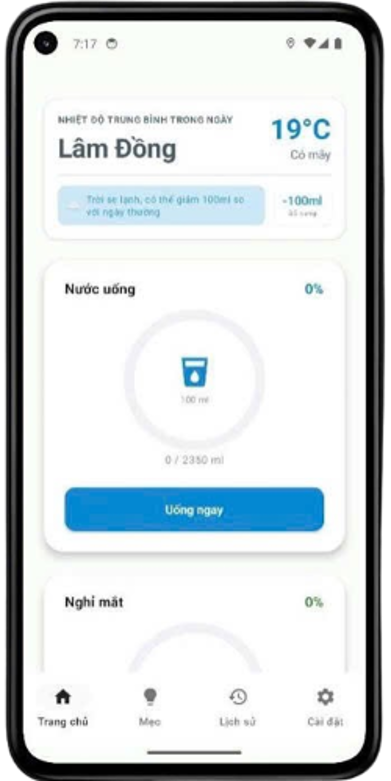
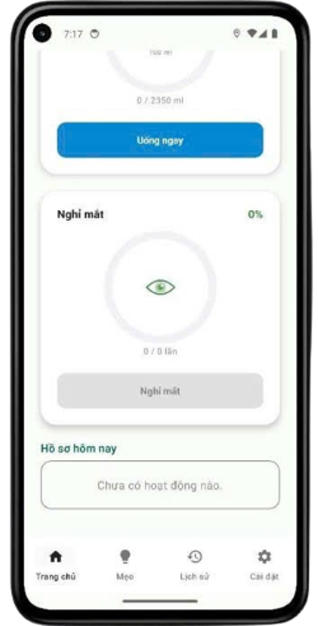
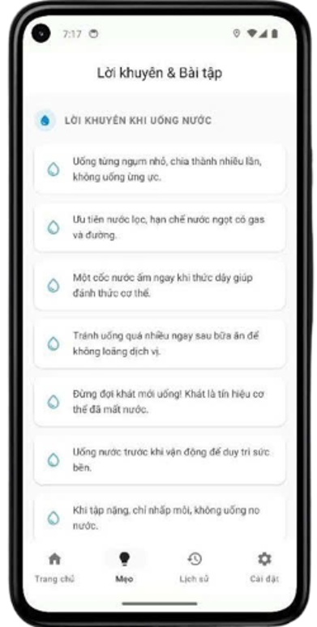
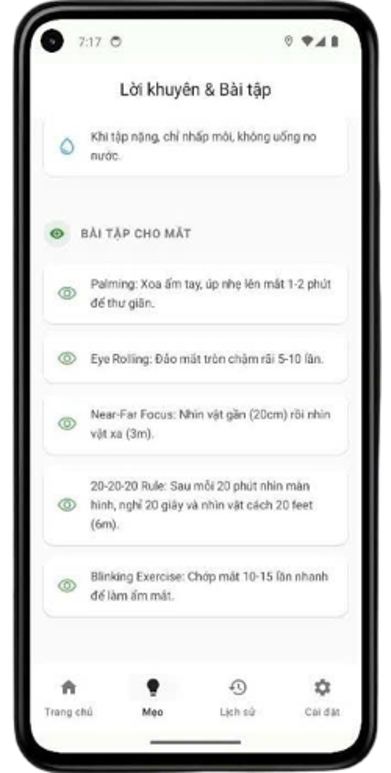
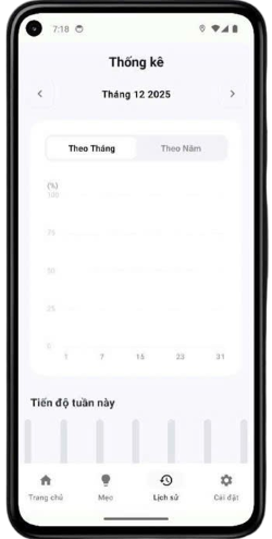
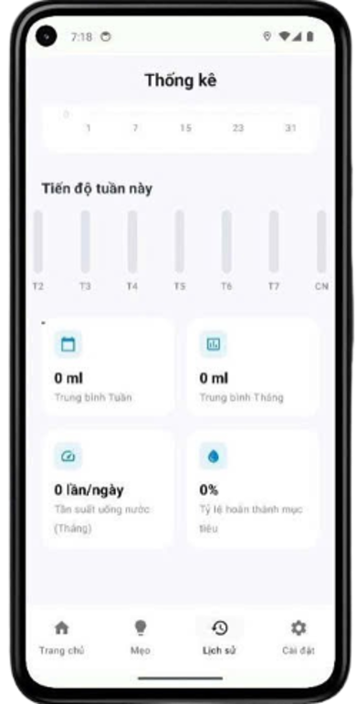
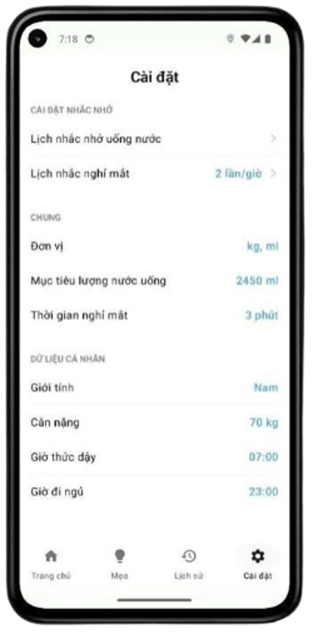

# BlinkDrink

BlinkDrink là ứng dụng di động Android đóng vai trò như một **trợ lý sức khỏe cá nhân** dành cho lập trình viên và nhân viên văn phòng. Ứng dụng giúp khắc phục tình trạng mỏi mắt, giảm thị lực và mất nước do làm việc liên tục trước màn hình bằng cách cung cấp các nhắc nhở uống nước thông minh và nghỉ ngơi mắt khoa học.

---

## Tính năng chính

- **Nhắc nhở uống nước thông minh**
  - Tính toán lượng nước cần thiết dựa trên cân nặng, giới tính và nhiệt độ môi trường thực tế (qua API thời tiết).
  - Ghi lại và thống kê lịch sử uống nước theo thời gian thực.

- **Nhắc nhở nghỉ ngơi mắt**
  - Cho phép tùy chỉnh tần suất nhắc nhở (1–6 lần/giờ).
  - Gửi thông báo định kỳ để người dùng rời mắt khỏi màn hình, kết hợp với các bài tập giảm căng thẳng thị giác.

- **Giao diện hiện đại**
  - Xây dựng bằng **Jetpack Compose** với phong cách **Material Design 3**.
  - Tông màu xanh – trắng, tối giản, dễ nhìn, tối ưu cho trải nghiệm người dùng.

---

## Công nghệ sử dụng

- **Ngôn ngữ:** Kotlin
- **UI:** Jetpack Compose (Declarative UI)
- **Kiến trúc:** MVVM + Clean Architecture
- **Dependency Injection:** Hilt
- **Database:** Room (WaterLogDao, EyeBreakLogDao)
- **Key-Value Storage:** Jetpack DataStore
- **Networking:** Retrofit + Coroutines + Flow
- **Scheduling & Notifications:** WorkManager + NotificationManager
- **Location:** FusedLocationProviderClient (chỉ dùng để lấy nhiệt độ môi trường)

---

## Demo

### Trang chủ — Nhắc nhở uống nước & nghỉ mắt

| Uống nước | Nghỉ mắt |
|---|---|
|  |  |

### Mẹo & Bài tập

| Lời khuyên uống nước | Bài tập cho mắt |
|---|---|
|  |  |

### Thống kê

| Biểu đồ theo thời gian | Tổng hợp tuần |
|---|---|
|  |  |

### Cài đặt



---

## Các màn hình chính

- **Onboarding:** Thiết lập hồ sơ cá nhân (cân nặng, giới tính, mục tiêu nước).
- **Dashboard:** Tổng quan sức khỏe, lượng nước đã uống, lịch nghỉ mắt.
- **Tips:** Mẹo và hướng dẫn chăm sóc sức khỏe.
- **History:** Lịch sử uống nước và nghỉ mắt.
- **Settings:** Cài đặt tần suất nhắc nhở, mục tiêu nước, quyền riêng tư.

---

## Thông số kỹ thuật

- **Compile SDK:** Android 14 (API 34)
- **Target SDK:** Android 14 (API 34)
- **Minimum SDK:** Android 8.0 (API 26)
- **IDE:** Android Studio 2024.2.1.12

---

## Quyền và bảo mật

- `POST_NOTIFICATIONS` (Android 13+): Hiển thị thông báo nhắc nhở.
- `ACCESS_FINE_LOCATION` / `ACCESS_COARSE_LOCATION`: Lấy nhiệt độ môi trường từ API thời tiết.
- `INTERNET`: Kết nối API thời tiết.
- **Nguyên tắc Local-first:** Dữ liệu nhạy cảm chỉ lưu trữ cục bộ trên thiết bị, không theo dõi nền.

---

## Hướng dẫn cài đặt và chạy thử

### Yêu cầu

- Android Studio (khuyến nghị bản 2024.2.1.12 trở lên)
- JDK 17+
- Thiết bị/giả lập chạy Android 8.0 (API 26) trở lên

### Các bước thực hiện

1. Clone dự án
   ```bash
   git clone https://github.com/ngmnhat612/blinkdrink.git
   ```
2. Mở dự án bằng Android Studio
3. Đợi Gradle sync hoàn tất
4. Chạy ứng dụng trên thiết bị thật hoặc emulator (Shift+F10)

---

## Hướng phát triển

- Tích hợp thiết bị đeo (smartwatch, fitness tracker).
- Thêm thống kê nâng cao và biểu đồ trực quan.
- Hỗ trợ đa ngôn ngữ.
- Phiên bản iOS (SwiftUI + MVVM).

---

## Thành viên thực hiện

| Họ và tên | Vai trò |
|---|---|
| Nguyễn Minh Nhật | Trưởng nhóm |
| Trần Thanh Thúy | Thành viên |
| Nguyễn Đăng Gia Huy | Thành viên |

---

Dự án được phát triển trong quá trình học tập tại trường, nhằm thực hành xây dựng ứng dụng Android theo kiến trúc MVVM + Clean Architecture với Jetpack Compose.
